# Plants_Species_Image-Classification

##A. Project Overview
  
  It is a machine learning project that identifies and classifies different plant species from images. It uses image processing and deep learning techniques to analyze plant features such as leaves, flowers, and overall structure, helping automate species recognition for applications in agriculture, botany, and environmental research.

  The purpose of the image classification model is to automatically identify and classify plant species from digital images using machine learning techniques. By analyzing visual characteristics such as leaf shape, color, texture, and structural patterns, the model can accurately recognize and categorize different plant species. This approach helps improve the efficiency and accuracy of plant identification compared to traditional manual methods. The model can support applications in botanical research, agriculture, biodiversity conservation, and educational systems by providing a faster and more accessible way to identify plant species.

##B. Plant Species Section

## Alpine Wood Fern

**Common Name:** Alpine Wood Fern  
**Scientific Name:** *Dryopteris wallichiana*

**Description:**  
The Alpine Wood Fern is a species of fern known for its large, feathery fronds and dark green foliage.

## Autumn Fern

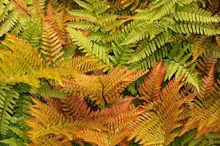

**Common Name:** Autumn Fern  
**Scientific Name:** *Dryopteris erythrosora*

**Description:**  
The Autumn Fern is a deciduous fern known for its copper-colored young fronds that gradually turn dark green as they mature. It commonly grows in shaded woodland areas and moist forest environments. This fern is widely used as an ornamental plant in gardens due to its attractive seasonal color changes and hardy nature.

## Bird's Nest Fern

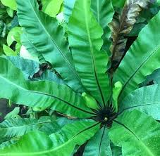

**Common Name:** Bird's Nest Fern  
**Scientific Name:** *Asplenium nidus*

**Description:**  
The Bird's Nest Fern is a tropical fern characterized by its broad, bright green fronds that grow in a rosette shape resembling a bird's nest. It typically grows on trees in humid forest environments and is widely cultivated as a decorative indoor plant.

## Boston Fern

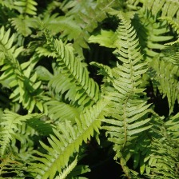

**Common Name:** Boston Fern  
**Scientific Name:** *Nephrolepis exaltata*

**Description:**  
The Boston Fern is a popular ornamental fern known for its long, arching fronds and delicate leaflets. It thrives in humid environments and is commonly grown as a houseplant. It is valued for its lush appearance and air-purifying properties.

## Bracken Fern

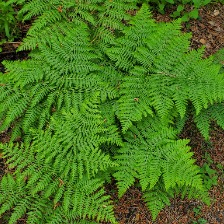

**Common Name:** Bracken Fern  
**Scientific Name:** *Pteridium aquilinum*

**Description:**  
The Bracken Fern is one of the most widespread fern species in the world. It has large triangular fronds that grow from underground rhizomes. This fern is commonly found in forests, grasslands, and open areas.

## Broad Beech Fern

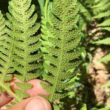

**Common Name:** Broad Beech Fern  
**Scientific Name:** *Phegopteris hexagonoptera*

**Description:**  
The Broad Beech Fern is a woodland fern recognized for its triangular fronds and delicate leaf structure. It commonly grows in shaded forests and moist soils. The plant spreads through underground rhizomes forming small colonies.

## Crocodile Fern

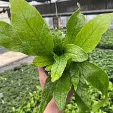

**Common Name:** Crocodile Fern  
**Scientific Name:** *Microsorum musifolium*

**Description:**  
The Crocodile Fern is named for its unique leaf texture that resembles crocodile skin. It is a tropical fern that grows well in humid environments and shaded areas. It is commonly used as an ornamental indoor plant.

## Dragon Scale Fern

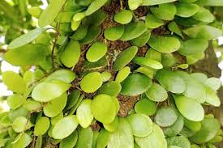

**Common Name:** Dragon Scale Fern  
**Scientific Name:** *Pyrrosia piloselloides*

**Description:**  
The Dragon Scale Fern is a small epiphytic fern known for its distinctive round leaves covered with golden scales. It often grows on tree trunks and rocks in tropical forests. The plant is valued for its unusual leaf pattern and ornamental appearance.

## Giant Leather Fern

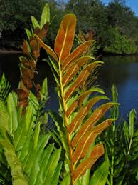

**Common Name:** Giant Leather Fern  
**Scientific Name:** *Acrostichum danaeifolium*

**Description:**  
The Giant Leather Fern is a large fern species commonly found in coastal wetlands and mangrove swamps. It has thick, leathery fronds and can grow several meters tall. The plant plays an important role in wetland ecosystems.

## Hen and Chicken Fern

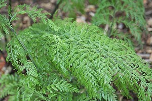

**Common Name:** Hen and Chicken Fern  
**Scientific Name:** *Asplenium bulbiferum*

**Description:**  
The Hen and Chicken Fern is known for producing small plantlets along its fronds, which resemble chicks surrounding a hen. These plantlets can fall off and grow into new plants. It is commonly grown as an ornamental fern.

## Holly Fern

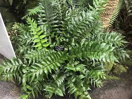

**Common Name:** Holly Fern  
**Scientific Name:** *Cyrtomium falcatum*

**Description:**  
The Holly Fern is an evergreen fern recognized for its glossy, dark green fronds with spiny edges resembling holly leaves. It is commonly grown in shaded gardens and indoor environments.

## Interrupted Fern

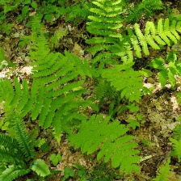

**Common Name:** Interrupted Fern  
**Scientific Name:** *Osmunda claytoniana*

**Description:**  
The Interrupted Fern gets its name from the interruption of fertile spore-producing leaflets in the middle of its fronds. It grows in moist woodlands and shaded forest habitats.

## Lady Fern

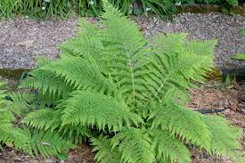

**Common Name:** Lady Fern  
**Scientific Name:** *Athyrium filix-femina*

**Description:**  
The Lady Fern is a graceful fern species with finely divided, light green fronds. It thrives in moist woodland environments and shaded areas. This fern is commonly used in landscape gardening.

## Maidenhair Fern

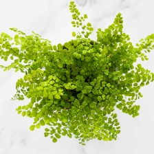

**Common Name:** Maidenhair Fern  
**Scientific Name:** *Adiantum capillus-veneris*

**Description:**  
The Maidenhair Fern is known for its delicate fan-shaped leaflets and thin black stems. It grows best in humid environments and shaded locations. This fern is widely cultivated as a decorative indoor plant.

## Marginal Wood Fern

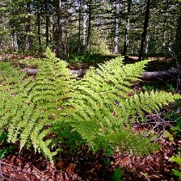

**Common Name:** Marginal Wood Fern  
**Scientific Name:** *Dryopteris marginalis*

**Description:**  
The Marginal Wood Fern is an evergreen fern found in rocky woodlands and forest environments. It has dark green leathery fronds and is known for the marginal placement of its spore clusters.

## Rabbit's Foot Fern

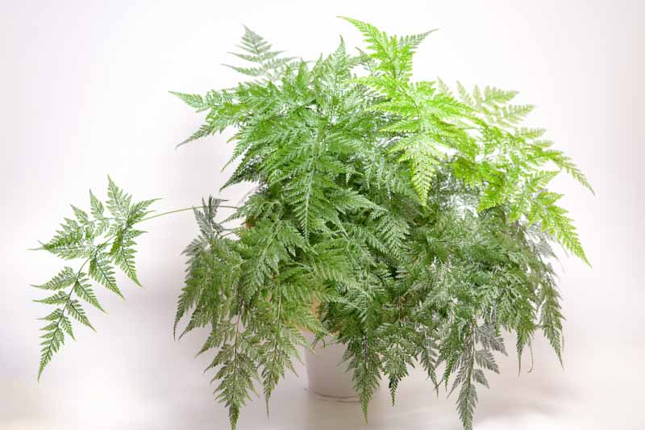

**Common Name:** Rabbit's Foot Fern  
**Scientific Name:** *Davallia fejeensis*

**Description:**  
The Rabbit's Foot Fern is named for its furry rhizomes that resemble a rabbit's foot. These rhizomes grow over the surface of the soil or pot. It is a popular ornamental houseplant.

