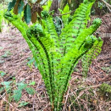

# Plants_Species_Image-Classification

A. Project Overview
  
  It is a machine learning project that identifies and classifies different plant species from images. It uses image processing and deep learning techniques to analyze plant features such as leaves, flowers, and overall structure, helping automate species recognition for applications in agriculture, botany, and environmental research.

  The purpose of the image classification model is to automatically identify and classify plant species from digital images using machine learning techniques. By analyzing visual characteristics such as leaf shape, color, texture, and structural patterns, the model can accurately recognize and categorize different plant species. This approach helps improve the efficiency and accuracy of plant identification compared to traditional manual methods. The model can support applications in botanical research, agriculture, biodiversity conservation, and educational systems by providing a faster and more accessible way to identify plant species.

## Alpine Wood Fern

**Common Name:** Alpine Wood Fern  
**Scientific Name:** *Dryopteris wallichiana*

**Description:**  
The Alpine Wood Fern is a species of fern known for its large, feathery fronds and dark green foliage. It typically grows in cool, moist forest environments and is commonly found in mountainous regions. This fern is valued for its ornamental appearance and ability to thrive in shaded areas.
